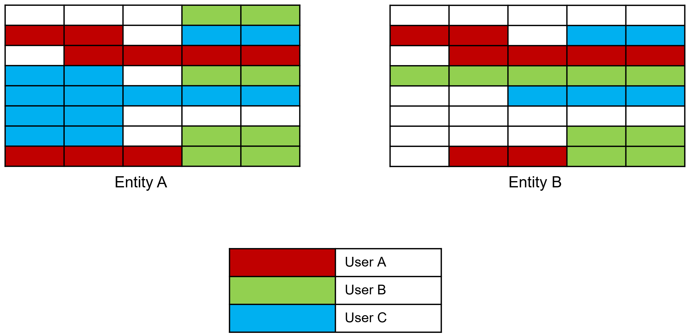
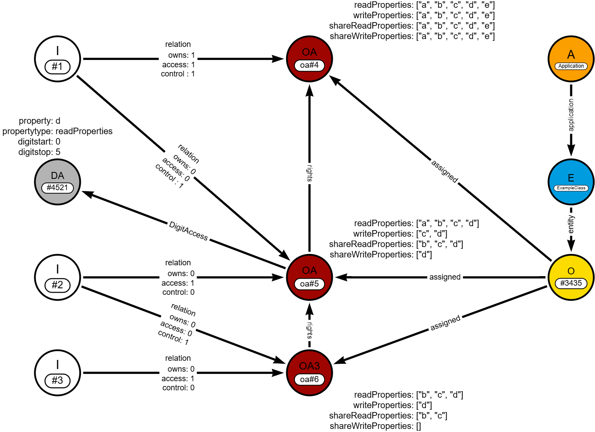

# Finest-Grained Object-Specific Attribute-Based Policy Machine with Inheritance

This policy machine can be integrated into your infrastructure to provide fine-grained access control for your data. It does not enforce access rules but rather stores them and checks them for logical consistency and validity. Also it validates the inheritance of shared access.

 The Service just stores and accomplishe the access rules of the stored data. It does not generates ids.
 It needs a neo4J database. So its graph based.

 The neo4J database can be started in Docker via the `docker-compose.yml` in the directory. The ***docker-compose*** command is commented in the file.

 Official public docker image of this repository:

 `docker pull saschakober/finest-grained-policy-machine`

## API Documentation

When running the applicaton, the swagger documentation is reachable over:

[http://localhost:8085/v1/swagger-ui/index.html](http://localhost:8085/v1/swagger-ui/index.html)


### Postman

There are complete imports for testing the api local with [Postman](https://www.postman.com/).


## Use Case

[](documentation/img/use_case_example.png)


For access management at the cell level of a database, many databases offer integrated solutions. However, for quick and simple permission assignments for specific objects within an entity (including rows and cell specific rules) this policy machine can be used.

Furthermore, the data provider can not only define what a data user is allowed to see but also what data they are permitted to share.


## How it works

### Abstract Layout
[](documentation/img/graph_standard_application_properties_digit_access.png)


| Label | Description |
| ----------- | ----------- |
| A | Application |
| I | Identity |
| E | Entity |
| O | Object |
| OA | Object Access |
| DA | Digit Access |

---
### Process

#### Creating an Identity
- Creating an identity by passing an id creates an I Node with that id

#### Creating an Object

- For creating an object you need an identity id
- Creating  an object creates an O Node, which is linked to an E node (Entity) based on the given entityClass in the object
- If the E node not exists, it will be created and then linked
- Then an OA node will be created with stores the properties (read, write, share) which are given with the object
- Then the I node (which is found by the given identity id) links to the OA node with `owns:1` relation


#### Relation Types


| Relation | Description | Allowed Actions |
| ----------- | ----------- | ----------- |
| owns | The creator | Can edit object |
| access | Defines the access to the object | Can edit nothing |
| control | Can change access for the child I for the object | Can edit the access properties |


## API

{{base_url}}=`localhost:8085/v1`


### Application

For multipurpose usage, this policy machine can store access rules for different applications in a single database. Access can be granted to one identity across multiple applications, without interference between them.

The identity must not exists. The identityId field is just for information.

#### Create an Application
POST `{baseUrl}/application`

RequestBody
```json
  {
    "applicationId": "f92a3c7b-1e6f-4a88-97df-b2d63a78c904",    
    "applicationName": "TestApplication",
    "identityId": "6bd841e2-7c4f-4c52-9a77-81ae6f8c1b36"
  }
```

ResponseBody
```json
  {
    "applicationId": "f92a3c7b-1e6f-4a88-97df-b2d63a78c904",    
    "applicationName": "TestApplication",
    "identityId": "6bd841e2-7c4f-4c52-9a77-81ae6f8c1b36"
  }
```

#### Get an Application
GET `{baseUrl}/application/{applicationId}`

ResponseBody
```json
  {
    "applicationId": "f92a3c7b-1e6f-4a88-97df-b2d63a78c904",    
    "applicationName": "TestApplication",
    "identityId": "6bd841e2-7c4f-4c52-9a77-81ae6f8c1b36"
  }
```

#### Get all Applications created by Identity
GET `{baseUrl}/application?identityId={{identityId}}`

ResponseBody
```json
 [ 
    {
    "applicationId": "f92a3c7b-1e6f-4a88-97df-b2d63a78c904",    
    "applicationName": "TestApplication",
    "identityId": "6bd841e2-7c4f-4c52-9a77-81ae6f8c1b36"
    }
  ...
  ]
```

#### Get all Applications
GET `{baseUrl}/application`

ResponseBody
```json
 [ 
    {
    "applicationId": "f92a3c7b-1e6f-4a88-97df-b2d63a78c904",    
    "applicationName": "TestApplication",
    "identityId": "6bd841e2-7c4f-4c52-9a77-81ae6f8c1b36"
    }
  ...
  ]
```


#### Delete
> **_BE AWARE_**  
> Deleting an application causes a complete delete of all connected nodes! 

> This endpoint is not implemented so far

DELETE `{baseUrl}/application/{applicationId}`


### Identity

An Identity can be a groupId, userId, companyId etc. It must be an unique Id in the scenario. Don't mix up groupIds and userIds. 
If the having the same Ids the access will be giving to an entire group than just a single user. So use the service just with one type of
id (userId, companyId or groupId etc.).


#### Create an Identity
POST `{baseUrl}/identity`

RequestBody
```json
{
    "id": "11c408e0-1fcd-11ee-be56-0242ac120006"   
}
```

ResponseBody
```json
{
    "id": "11c408e0-1fcd-11ee-be56-0242ac120005",
    "name": "identity#11c408e0-1fcd-11ee-be56-0242ac120005"
}
```


#### Get an Identity
GET `{baseUrl}/identity/{identityId}`

ResponseBody
```json
{
    "id": "11c408e0-1fcd-11ee-be56-0242ac120005",
    "name": "identity#11c408e0-1fcd-11ee-be56-0242ac120005"
}
```

#### Delete
DELETE `{baseUrl}/identity/{identityId}`

## Object

Objects are entities like 'Car', 'Person', 'Order' or 'Device' etc. 


### Create an Object

POST `{baseUrl}/application/{aplicationId}/object`

Create O Node (an object or entity for example entity 'Car' with color, wheels, doors, fuel) for Identity #11c408e0-1fcd-11ee-be56-0242ac120005. 
Define what properties the entity has (or rather which should be defined in the access control).

RequestBody
```json
{
    "identityId": "11c408e0-1fcd-11ee-be56-0242ac120005",
    "objectId": "03389644-a202-449a-8906-69fab4dbd137",
    "objectEntityClass": "Car",
    "properties": [
        "color",
        "wheels",
        "doors",
        "fuel"
    ]
}
```

RequestBody
```json
{
    "objectId": "03389644-a202-449a-8906-69fab4dbd137",
    "objectEntityClass": "Car",
    "name": "Car#03389644-a202-449a-8906-69fab4dbd137"
}
```

### Update an Object

PUT `{baseUrl}/application/{aplicationId}/object/{objectId}`

Only the creator identity can update his object. 


RequestBody
```json
{
    "identityId": "11c408e0-1fcd-11ee-be56-0242ac120005",   
    "objectEntityClass": "Motorbike",
    "properties": [
        "color",
        "wheels",     
        "fuel"
    ]
}
```

ResponseBody
```json
{
    "objectId": "03389644-a202-449a-8906-69fab4dbd137",
    "objectEntityClass": "Motorbike",
    "name": "Motorbike#03389644-a202-449a-8906-69fab4dbd137"
}
```
---

**IMPORTANT**: If the properties changed, the access is also changed recursiv! So for the owner the identityProperties will be set to the follwing example. If there a new properties, the will be just added to your access (non-recursiv). If properties are deleted, the will be deleted from you access and also recursiv.

For now there is no renaming function for properties.

```json
{
    "identityProperties":
      {
        "readProperties": ["color, wheels, fuel"],
        "writeProperties":  ["color, doors, fuel"],
        "shareReadProperties": ["color, wheels, fuel"],
        "shareWriteProperties":  ["color, wheels, fuel"]
      }
}
```

### Delete an Object

DELETE `{baseUrl}/application/{aplicationId}/object/{objectId}?requestedById={byId}`

Only the creator-identity (`{byId}`) can delete his object. It deletes the object and the accesses for all identities.
So if the object is deleted, the access is also deleted recursiv!


## Access Management

### Validation rules

1. You can't give more properties (read, write, share) than you have
2. WriteProperties can just be the readProperties or less
3. ShareReadProperties can just be readProperties or less
4. ShareWriteProperties can just be writeProperties or less

**IMPORTANT**: When you decrease the properties (of your own or an other identity) the will decrease recursiv for all child identitys which have access to this object over the identity you are updating.


### Get access for an object for an identity

GET `{baseUrl}/application/{aplicationId}/access/{objectId}?identityId={forId}&requestedById={byId}`

ResponseBody
```json
{
    "objectId": "b26f25e2-d95d-482c-9829-d51cdd975da6",
    "objectEntityClass": "GroupObject",
    "identityId": "f7e1f51c-1dd6-40d1-8269-4055b99f6b2b",
    "identityProperties":
      {
        "readProperties": ["color, wheels, fuel"],
        "writeProperties":  ["color, doors, fuel"],
        "shareReadProperties":  ["color"],
        "shareWriteProperties":  ["color"]
      }
}
```


### Get access for multiple objects for an identity

GET `{baseUrl}/application/{aplicationId}/access/?identityId={forId}&requestedById={byId}`

RequestBody
```json
{
"objectIds":
    [
    "d8a2e675-8d75-44ce-91ca-28ee2b20b4d3",
    "b26f25e2-d95d-482c-9829-d51cdd975da6",
    "744901a7-73c2-4a8c-8262-125fe79fef76",
    "563e19a1-08e7-419f-978f-261eddad785b"
    ]
}
```


ResponseBody
```json
{
    "objects": [
        {
            "objectId": "d8a2e675-8d75-44ce-91ca-28ee2b20b4d3",
            "objectEntityClass": "GroupObject",
            "identityId": "f7e1f51c-1dd6-40d1-8269-4055b99f6b2b",
            "objectProperties": {
                "readProperties":  ["color, wheels, fuel"],
                "writeProperties": ["color, wheels, fuel"],
                "shareReadProperties": ["color, wheels, fuel"],
                "shareWriteProperties": ["color, wheels, fuel"]
            }
        },
        
        
         (more Objects)
    ]
}

```


### Get access for all objects of an entity in an application

GET `{baseUrl}/application/{aplicationId}/access/search/?identityId={forId}&requestedById={byId}&objectEntityClass={Class}&createdByMyOwn=true&pagesize=1000`

#### Optional Parameters
- identityId
- createdByMyOwn
- pagesize


When no identityId is given, then it searches for all access for requestedById. When identityId is given then it filters the result for identityId.

createdByMyOwn: When true-> the access I shared. When false-> the access I've got.

Pagesize: Default is 300. Max is 10000.


ResponseBody
```json
{
    "objects": [
        {
            "objectId": "d8a2e675-8d75-44ce-91ca-28ee2b20b4d3",
            "objectEntityClass": "GroupObject",
            "identityId": "f7e1f51c-1dd6-40d1-8269-4055b99f6b2b",
            "objectProperties": {
                "readProperties":  ["color, wheels, fuel"],
                "writeProperties": ["color, wheels, fuel"],
                "shareReadProperties": ["color, wheels, fuel"],
                "shareWriteProperties": ["color, wheels, fuel"]
            }
        },
        ...
    ]
}

```


### Create access for an object for an identity

PUT `{baseUrl}/application/{aplicationId}/access/{objectId}?identityId={forId}&requestedById={byId}`

Create Access for an object by {id} for an identity `{forId}` by the requesting identity `{byId}`.
For example I will give you access to my object. Then the identityId is your Id and the requestedById is myId.


RequestBody
```json
{
    "identityProperties":
      {
        "readProperties": ["color, wheels, fuel"],
        "writeProperties":  ["color, doors, fuel"],
        "shareReadProperties":  ["color"],
        "shareWriteProperties":  ["color"]
      }
}
```

ResponseBody
```json
{
    "objectId": "03389644-a202-449a-8906-69fab4dbd137",
    "objectEntityClass": "Motorbike",
    "identityId": "11c408e0-1fcd-11ee-be56-0242ac120006",
    "identityProperties":
      {
        "readProperties": ["color, wheels, fuel"],
        "writeProperties":  ["color, doors, fuel"],
        "shareReadProperties":  ["color"],
        "shareWriteProperties":  ["color"]
      }
}
```


#### With defined digit access for an object for an identity

You are also enabled to define access for each character of the field. In this Example, the identity gets access to read the properties "color, wheels, fuel", but for "color" the identity will only see the digits 1-8 and 10-15.
Example: When the value "color" is "purple-green-red" it will only get acccess to "purple-geen-re" (if this makes sense).
Also the digit access rules will be combined if the overlap. See response.

RequestBody
```json
{
    "identityProperties":
      {
        "readProperties": ["color, wheels, fuel"],
        "writeProperties":  ["color, doors, fuel"],
        "shareReadProperties":  ["color"],
        "shareWriteProperties":  ["color"],
        "digitsAccess": [
            {
                "property": "wheels",
                "readableDigits": [
                    {
                        "readableDigitsFrom": 1,
                        "readableDigitsTo": 8
                    },
                    {
                        "readableDigitsFrom": 10,
                        "readableDigitsTo": 15
                    },
                    {
                        "readableDigitsFrom": 1,
                        "readableDigitsTo": 4
                    }
                ],
                "type": "shareReadProperties"
            },
            {
                "property": "color",
                "readableDigits": [
                    {
                        "readableDigitsFrom": 3,
                        "readableDigitsTo": 10
                    }
                ],
                "type": "readProperties"
            }
        ]
      }
}
```

ResponseBody
```json
{
    "objectId": "03389644-a202-449a-8906-69fab4dbd137",
    "objectEntityClass": "Motorbike",
    "identityId": "11c408e0-1fcd-11ee-be56-0242ac120006",
    "identityProperties":
      {
        "readProperties": ["color, wheels, fuel"],
        "writeProperties":  ["color, doors, fuel"],
        "shareReadProperties":  ["color"],
        "shareWriteProperties":  ["color"],
        "digitsAccess": [
            {
                "property": "wheels",
                "readableDigits": [
                    {
                        "readableDigitsFrom": 1,
                        "readableDigitsTo": 8
                    },
                    {
                        "readableDigitsFrom": 10,
                        "readableDigitsTo": 15
                    }
                ],
                "type": "shareReadProperties"
            },
            {
                "property": "color",
                "readableDigits": [
                    {
                        "readableDigitsFrom": 3,
                        "readableDigitsTo": 10
                    }
                ],
                "type": "readProperties"
            }
        ]
      }
}
```


### Update access for an object for an identity

PUT `{baseUrl}/application/{aplicationId}/access/{objectId}?identityId={forId}&requestedById={byId}`

Update Access for an object by {id} for an identity `{forId}` by the requesting identity `{byId}`.
Be aware of the validation effects.

**IMPORTANT**: You can only give rights that are equal or less than you rights. So you can't give more rights than you have. That also means if you want to update your rights than you can't give you more rights than you currently have, even if you are the owner of the object. If you are the owner and want to set new properties to your identity than you have to update the object properties via the object endpoint `/object/{id}`.

RequestBody
```json
{
    "identityProperties":
      {
        "readProperties": ["color, wheels, fuel"],
        "writeProperties":  ["color, doors, fuel"],
        "shareReadProperties":  ["color"],
        "shareWriteProperties":  ["color, fuel"]
      }
}
```

ResponseBody
```json
{
    "objectId": "03389644-a202-449a-8906-69fab4dbd137",
    "objectEntityClass": "Motorbike",
    "identityId": "11c408e0-1fcd-11ee-be56-0242ac120006",
    "identityProperties":
      {
        "readProperties": ["color, wheels, fuel"],
        "writeProperties":  ["color, doors, fuel"],
        "shareReadProperties":  ["color"],
        "shareWriteProperties":  ["color, fuel"]
      }
}
```
---

**IMPORTANT**: You can send the Requestbody also like this exmaple. But because this is a PUT Request the `shareReadProperties` and `shareWriteProperties` will be set to an empty list `[]` (also recursiv!).

RequestBody
```json
{
    "identityProperties":
      {
        "readProperties": ["color, wheels, fuel"],
        "writeProperties":  ["color, doors, fuel"]     
      }
}
```

#### With defined digit access for an object for an identity

see Section **Create access for an object for an identity** -> **With defined digit access for an object for an identity**


### Delete access for an object for an identity

DELETE `{baseUrl}/application/{aplicationId}/access/{objectId}?identityId={forId}&requestedById={byId}`

Delete access for an object for an identity `{forId}` by a identity `{byId}`.

**IMPORTANT**: This deletes recursive all access given through the identity `{forId}`.


## Helpers

When the Entityproperties are changed in a data service the properties can changed here to.

### Add Property to all my objects of an Entity
For example: Car has a new property 'HorsePower' and it need to be in all of my objects of entityclass "Car" then 
I can use this endpoint.


POST `{baseUrl}/application/{aplicationId}/helpers/entity/addProperty?requestedById={byId}`

RequestBody
```json
{
    "entityClass": "Car",
    "propertyNewName": "HorsePower"
}
```

### Rename Property to all my objects of an Entity
When my Entity has a renamed property like "HorsePower" is now "Hp" then I can use this Endpoint to change the property name.

POST `{baseUrl}/application/{aplicationId}/helpers/entity/renameProperty?requestedById={byId}`

RequestBody
```json
{
    "entityClass": "Motorbike",
    "propertyOldName": "farbe",
    "propertyNewName": "color"
}
```


## Open Source License

This project is licensed under the [MIT License](https://opensource.org/licenses/MIT).

## MIT License

Copyright (c) [2025] [Sascha Kober]

Permission is hereby granted, free of charge, to any person obtaining a copy of this software and associated documentation files (the "Software"), to deal in the Software without restriction, including without limitation the rights to use, copy, modify, merge, publish, distribute, sublicense, and/or sell copies of the Software, and to permit persons to whom the Software is furnished to do so, subject to the following conditions:

The above copyright notice and this permission notice shall be included in all copies or substantial portions of the Software.

THE SOFTWARE IS PROVIDED "AS IS", WITHOUT WARRANTY OF ANY KIND, EXPRESS OR IMPLIED, INCLUDING BUT NOT LIMITED TO THE WARRANTIES OF MERCHANTABILITY, FITNESS FOR A PARTICULAR PURPOSE AND NONINFRINGEMENT. IN NO EVENT SHALL THE AUTHORS OR COPYRIGHT HOLDERS BE LIABLE FOR ANY CLAIM, DAMAGES OR OTHER LIABILITY, WHETHER IN AN ACTION OF CONTRACT, TORT OR OTHERWISE, ARISING FROM, OUT OF OR IN CONNECTION WITH THE SOFTWARE OR THE USE OR OTHER DEALINGS IN THE SOFTWARE.
